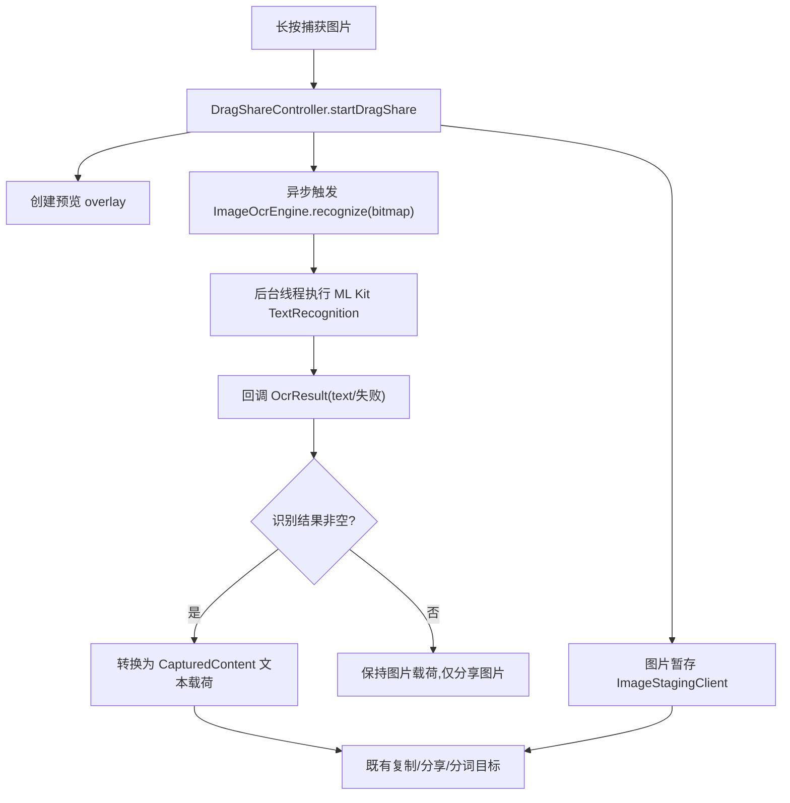

# 图片文字提取(OCR)设计文档

Feature Name: image-ocr-text-extraction
Updated: 2026-08-11

## Description

为 HyperDragShare 的图片拖拽链路增加 OCR 能力。当前长按图片只做区域截图并作为图片分享;
本特性在图片预览显示后自动启动 ML Kit 离线文本识别,识别结果以普通文本载荷交付给既有
复制/分享/分词链路。OCR 全程本地离线执行,不阻塞当前拖拽手势。

## Architecture



OCR 识别与图片暂存并行;拖拽松手时,若 OCR 已就绪则按文本载荷分享,否则按图片载荷分享。
识别永不阻塞手势,也永不改变图片暂存链路。

## Components and Interfaces

### 新增组件: ImageOcrEngine

路径: `app/src/main/java/com/leaf/hyperdragshare/codex/ImageOcrEngine.java`

职责: 包装 ML Kit 文本识别,输入 Bitmap,异步输出识别文本。

```java
final class ImageOcrEngine {
    interface Callback {
        void onResult(String text);
        void onFailure(Throwable error);
    }

    static void recognize(
            Context context,
            Bitmap bitmap,
            Executor executor,
            Callback callback);
}
```

行为:
- `recognize` 在 `executor` 上执行,内部用 `TextRecognition.getClient(...)` + `InputImage.fromBitmap`。
- 识别前对超大图片按 `OCR_MAX_DIMENSION_PX`(1280)缩放,保持宽高比。
- 单例复用 TextRecognizer 以降低首帧开销;`onDestroy`/会话结束不主动 close(进程级单例,依赖
  LSPosed 常驻)。
- 失败(空图、异常)走 `onFailure`,由调用方决定保持图片载荷。

### 修改组件: DragShareController

集成点 `startDragShare(...)` 的 `payload.isImage()` 分支(当前文件 494-522 行),在
`ImageStagingClient.stage` 旁并行调用:

```java
if (payload.isImage() && settings.isImageOcrEnabled()) {
    final Session ocrSession = session;
    ImageOcrEngine.recognize(
            context,
            payload.bitmap,
            ocrExecutor,
            new ImageOcrEngine.Callback() {
                @Override public void onResult(String text) {
                    mainHandler.post(() -> {
                        if (destroyed || ocrSession.cancelled) return;
                        ocrSession.ocrText = text;
                        if (ocrSession.ocrText != null
                                && !ocrSession.ocrText.trim().isEmpty()) {
                            ocrSession.ocrReady = true;
                            refreshShareTargetsIfNeeded(ocrSession);
                        }
                    });
                }
                @Override public void onFailure(Throwable error) {
                    mainHandler.post(() -> {
                        if (!destroyed && !ocrSession.cancelled) {
                            log("image ocr failed", error);
                        }
                    });
                }
            });
}
```

`Session` 增加两个字段: `String ocrText;` `boolean ocrReady;`

### 修改组件: Session 与分享决策

松手分享路径(`launchShare`/`launchPendingShare`,当前 1562-1600 行附近):

- 若 `ocrReady && ocrText 非空`,构造文本载荷 `CapturedContent.text(ocrText, ...)` 执行分享,
  否则维持图片载荷。
- 分享目标查询:文本载荷走 `ShareTargetRepository.query(context, "text/plain")`,天然获得
  复制文本、文本分词和文本分享目标。

### 修改组件: DragShareSettings

新增开关键 `image_ocr_enabled`(默认 true),加入本地持久化与设置页开关项,并接入
`DragShareSettings` 的 readLocal/writeLocal 序列化与默认值。

### 修改组件: SettingsScreen.kt

在"内容开关"分组新增"图片文字识别"开关项,绑定 `image_ocr_enabled`。

### 修改组件: build.gradle / proguard-rules.pro

- `app/build.gradle` dependencies 增加:
  `implementation 'com.google.mlkit:text-recognition:16.0.1'`
- `proguard-rules.pro` 增加 ML Kit 保留规则(官方推荐的 `-keep` 规则,防止 R8 裁剪模型加载
  路径)。APK 体积增加约 2-4 MB。

## Data Models

### Session 扩展

| 字段 | 类型 | 说明 |
|------|------|------|
| `ocrText` | `String` | OCR 识别出的文本;null 表示未完成或失败 |
| `ocrReady` | `boolean` | OCR 是否已完成且文本非空 |

### 开关存储

- 键: `image_ocr_enabled`
- 类型: boolean
- 默认值: `true`
- 持久化: 既有 `DragShareSettings` SharedPreferences(模块 UID)

## Correctness Properties

1. OCR 识别结果只在识别线程产生,主线程通过 `mainHandler` 接收,与既有图片暂存回调并发安全。
2. 会话销毁(cancelled/destroyed)后,OCR 回调被忽略,不触碰已释放的 UI。
3. 识别空文本(纯色图片、截图按钮等)保持图片载荷,不误判为文本。
4. 关闭开关后,`isImageOcrEnabled()` 为 false,不启动 OCR,行为与 1.8.1 一致。
5. OCR 不改变图片暂存/分享/URI grant 链路(AGENTS.md 约束 5、6)。
6. 识别使用离线 bundled 模型,无网络请求(约束 12 之外的无障碍窗口内容获取不涉及)。

## Error Handling

| 场景 | 处理 |
|------|------|
| ML Kit 初始化失败(模型加载异常) | `onFailure` → 保持图片载荷,分享不受影响 |
| 输入图片已回收/为空 | `recognize` 直接 `onFailure`,不抛主线程异常 |
| 识别超时(>3s) | 后台仍继续,松手优先图片载荷;不阻塞手势 |
| R8 裁剪导致识别崩溃 | proguard 保留规则兜底;release 阶段回归验证 |

## Test Strategy

### 单元测试

- `ImageOcrEngine` 缩放逻辑:超大 Bitmap 缩放到 1280 内并保持宽高比(纯函数抽离,如
  `ImageOcrEngine.computeScaledBounds(width, height, maxDimension)`),对输入进行缩放判断。
- `DragShareSettings` 新增开关:默认值、读写持久化、range/类型校验。
- 分享决策:给定 `ocrReady` 与文本,选择文本载荷;给定 `ocrReady=false`,保持图片载荷
  (抽取纯决策函数 `OcrShareDecision` 以便单测)。

### 集成验证

- `testDebugUnitTest lintDebug assembleDebug` 全绿。
- 实机:长按含中文/英文文本的图片,预览出现后自动识别,拖动到"复制"/"文本分词"目标,
  确认文本被复制/分词;识别空图片确认仍按图片分享;关闭开关后确认不 OCR。
- release 回归:R8 后 OCR 仍可用(新增 proguard 规则)。

## References

[^1]: Google ML Kit Text recognition (bundled) — https://developers.google.com/ml-kit/vision/text-recognition/android
[^2]: (app/build.gradle#L116-L133) — 现有 dependencies,新增 ML Kit 依赖
[^3]: (app/src/main/java/com/leaf/hyperdragshare/codex/DragShareController.java#L494-L522) — 图片暂存集成点
[^4]: (app/src/main/java/com/leaf/hyperdragshare/codex/DragShareController.java#L1562-L1600) — 松手分享路径
[^5]: (app/src/main/java/com/leaf/hyperdragshare/codex/ShareTargetRepository.java#L99-L141) — 文本/图片目标分流
[^6]: (app/src/main/java/com/leaf/hyperdragshare/codex/DragShareSettings.java) — 开关持久化
